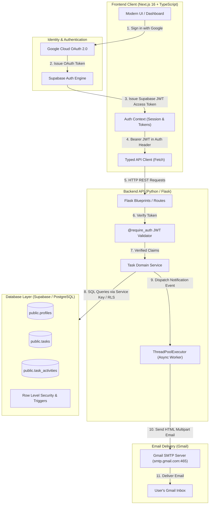

# TaskFlow — Distributed Task Management Web Application

A full-stack, production-ready collaborative task management application built with **Next.js (TypeScript)**, **Flask (Python)**, **Supabase (PostgreSQL)**, and **Gmail SMTP**.

---

## 🏗️ System Architecture



---

## ⚡ Core Features

1. **Google OAuth 2.0 Authentication**:
   - Single-sign-on using Gmail/Google accounts via Supabase Auth.
   - Built-in **Demo Reviewer Mode** allowing evaluators to preview all features instantly without requiring local OAuth client IDs.
2. **Task Creation & Management**:
   - Create, edit, and delete tasks with title, description, priority (`low`, `medium`, `high`, `urgent`), due date, and assignees.
   - Interactive status lifecycle (`todo` &rarr; `in_progress` &rarr; `completed` &rarr; `cancelled`).
3. **Multi-User Task Assignment**:
   - Dynamic user directory fetching team members from `public.profiles`.
   - Assign tasks to any colleague with real-time avatar previews.
4. **Automated Gmail Notifications**:
   - **On Task Creation**: When assigned to a user, an HTML email is delivered to their Gmail inbox with task summary, priority badge, due date, and direct application link.
   - **On Task Completion**: When a task is marked completed, a notification is dispatched to the task creator and assignee.
   - **Asynchronous Delivery**: Uses Python `ThreadPoolExecutor` to eliminate SMTP latency from blocking the Flask request-response cycle.
5. **Modern Vanilla CSS Aesthetics**:
   - Crafted with custom design tokens, glassmorphism (`backdrop-filter: blur`), dark-themed foundation, responsive grid, accessible modal `<dialog>`, and floating toast alerts.

---

## 📁 Repository Structure

```
├── .env.example               # Root configuration template
├── docker-compose.yml         # Containerized local multi-service orchestration
├── render.yaml                # Render Blueprint deployment specification
├── vercel.json                # Vercel deployment configuration
├── migrations/                # Versioned SQL migrations for Supabase
│   ├── 01_initial_schema.sql  # Tables, constraints, and indexes
│   ├── 02_triggers_and_functions.sql # Automatic profile syncing & timestamp updates
│   ├── 03_rls_policies.sql    # PostgreSQL Row Level Security policies
│   └── README.md              # Migration documentation
├── backend/                   # Flask REST API
│   ├── app.py                 # Application factory with CORS & error handlers
│   ├── config.py              # Environment configuration loader
│   ├── requirements.txt       # Python dependencies
│   ├── Procfile               # Production Gunicorn process runner
│   ├── Dockerfile             # Production container definition
│   ├── middleware/
│   │   └── auth_middleware.py # @require_auth decorator for Supabase JWT verification
│   ├── routes/
│   │   ├── auth.py            # /api/auth/sync, /api/auth/me
│   │   ├── tasks.py           # /api/tasks CRUD & status toggles
│   │   ├── users.py           # /api/users assignee directory
│   │   └── health.py          # /api/health telemetry
│   └── services/
│       ├── supabase_client.py # Supabase client singleton
│       ├── task_service.py    # Business logic & event hooks
│       └── email_service.py   # Asynchronous Gmail SMTP notification engine
└── frontend/                  # Next.js 16 + TypeScript Frontend
    ├── app/
    │   ├── layout.tsx         # Root layout with Auth & Toast providers
    │   ├── globals.css        # Vanilla CSS design system
    │   ├── page.tsx           # Main task dashboard
    │   ├── login/page.tsx     # Google OAuth & Demo sign-in view
    │   └── auth/callback/page.tsx # OAuth token exchange handler
    ├── components/
    │   ├── Navbar.tsx         # Header, avatar, and quick action bar
    │   ├── StatsCards.tsx     # Live status & priority metrics
    │   ├── FilterBar.tsx      # Filtering & search controls
    │   ├── TaskCard.tsx       # Task card with completion toggle
    │   └── TaskModal.tsx      # Accessible task creation & editing modal
    ├── context/
    │   ├── AuthContext.tsx    # Authentication state management
    │   └── ToastContext.tsx   # Toast notification dispatcher
    ├── lib/
    │   ├── api.ts             # Typed HTTP client communicating with Flask
    │   └── supabase.ts        # Supabase client singleton
    └── types/
        └── index.ts           # Domain TypeScript interfaces
```

---

## 🛠️ Step-by-Step Setup Guide

### 1. Database Setup (Supabase)

1. Create a free project on [Supabase](https://supabase.com).
2. Go to the **SQL Editor** tab in your Supabase dashboard.
3. Execute the migration files located in `migrations/` in order:
   - Run `migrations/01_initial_schema.sql`
   - Run `migrations/02_triggers_and_functions.sql`
   - Run `migrations/03_rls_policies.sql`
4. Copy your **Project URL**, **Anon Key**, and **Service Role Key** from **Project Settings &rarr; API**.
5. Enable **Google Provider** under **Authentication &rarr; Providers**:
   - In [Google Cloud Console](https://console.cloud.google.com), create an OAuth 2.0 Client ID (Web Application).
   - Set Authorized Redirect URI to: `https://<your-project-ref>.supabase.co/auth/v1/callback`.
   - Copy Client ID and Client Secret into your Supabase Google Provider configuration.

---

### 2. Gmail SMTP Setup (For Email Notifications)

1. Enable **2-Step Verification** on your Google Account: [Google Account Security](https://myaccount.google.com/security).
2. Generate an **App Password**: [Google App Passwords](https://myaccount.google.com/apppasswords).
   - App: `Mail`
   - Device: `TaskFlow`
3. Copy the generated 16-character password (e.g., `abcd efgh ijkl mnop`).

*(Note: If Gmail credentials are left blank in local development, emails are safely logged to the console so features can be tested offline without errors.)*

---

### 3. Backend Setup (Flask)

```bash
cd backend

# Create and activate virtual environment
python -m venv .venv
# On Windows PowerShell:
.venv\Scripts\Activate.ps1
# On macOS/Linux:
source .venv/bin/activate

# Install dependencies
pip install -r requirements.txt

# Configure environment
cp .env.example .env
# Edit .env with your Supabase credentials and Gmail App Password

# Start Flask development server
python app.py
```
The Flask API will run on `http://localhost:5000`.

---

### 4. Frontend Setup (Next.js)

```bash
cd frontend

# Install dependencies
npm install

# Configure environment
cp .env.example .env.local
# Edit .env.local with your Supabase URL and Anon Key

# Start Next.js development server
npm run dev
```
Open `http://localhost:3000` in your browser.

---

## 🚢 Production Deployment Guide

### Deploy Backend (Render / Railway)

1. **Render**:
   - Push your code to GitHub.
   - On [Render](https://render.com), click **New + &rarr; Blueprint** and select this repository.
   - Render will detect `render.yaml` and configure the Flask web service using Gunicorn.
   - Under Environment Variables, supply `SUPABASE_URL`, `SUPABASE_SERVICE_ROLE_KEY`, `SUPABASE_JWT_SECRET`, `GMAIL_USER`, and `GMAIL_APP_PASSWORD`.
2. **Railway**:
   - Click **New Project &rarr; Deploy from GitHub repo**.
   - Select the `backend` subfolder or let Railway read `backend/Procfile`.
   - Set environment variables in the Railway dashboard.

### Deploy Frontend (Vercel)

1. Go to [Vercel](https://vercel.com/new).
2. Import your GitHub repository.
3. Set the **Root Directory** to `frontend`.
4. Configure Environment Variables:
   - `NEXT_PUBLIC_SUPABASE_URL`: `https://<your-project>.supabase.co`
   - `NEXT_PUBLIC_SUPABASE_ANON_KEY`: `<your-anon-key>`
   - `NEXT_PUBLIC_API_URL`: `https://<your-backend-render-or-railway-url>/api`
   - `NEXT_PUBLIC_APP_URL`: `https://<your-app-domain>.vercel.app`
5. Click **Deploy**.

---

## 📡 REST API Reference

| Endpoint | Method | Auth | Description |
|---|---|---|---|
| `/api/health` | `GET` | No | Operational status and external dependency health |
| `/api/auth/sync` | `POST` | Yes | Synchronizes authenticated Google OAuth profile |
| `/api/auth/me` | `GET` | Yes | Retrieves current user profile |
| `/api/users` | `GET` | Yes | Retrieves list of assignable team members |
| `/api/tasks` | `GET` | Yes | Retrieves tasks (supports `status`, `priority`, `filter`, `search`) |
| `/api/tasks` | `POST` | Yes | Creates task & dispatches assignment email via Gmail |
| `/api/tasks/<id>` | `GET` | Yes | Retrieves single task details |
| `/api/tasks/<id>` | `PUT` | Yes | Updates task details |
| `/api/tasks/<id>/status` | `PATCH` | Yes | Updates task status (dispatches email on `completed`) |
| `/api/tasks/<id>` | `DELETE` | Yes | Deletes a task |

---

## 🎯 Technical Interview Preparation

A comprehensive, deep-dive interview preparation guide is provided in [`INTERVIEW_GUIDE.md`](file:///c:/interview%20assignment/Hair_drama_tech/Task-Management-app/INTERVIEW_GUIDE.md). It details:
- Complete architectural rationale and design trade-offs
- Detailed explanations of Google OAuth 2.0 PKCE and JWT validation
- Why `ThreadPoolExecutor` is used for Gmail notifications vs Celery
- 12 in-depth technical questions and model answers
